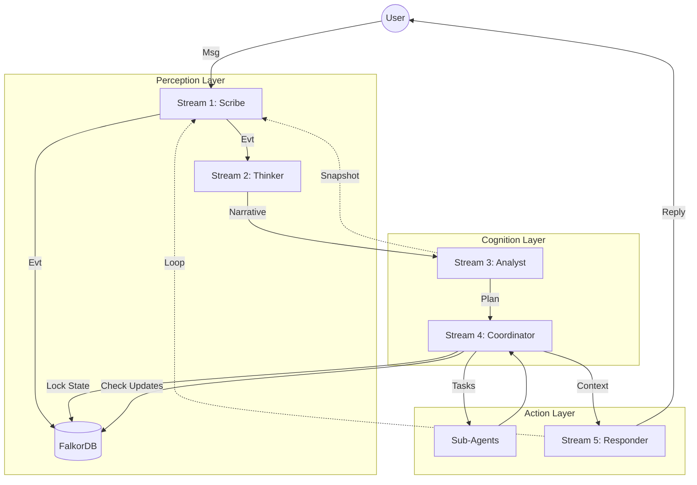

# 🌊 Gemini Observer: Stream Architecture V2 (Deep Cognition)

## 🌀 Philosophy: The Flow
Архітектура базується на безперервному потоці даних, що імітує когнітивні процеси: **Сприйняття -> Інтуїція -> Стратегія -> Координація -> Дія -> Рефлексія**.

---

## 1️⃣ Stream 1: The Scribe (Perception & Memory)
**Role:** Єдине джерело правди. Детермінований запис подій у Граф.
**Input:** `redis:ingestion_queue`.

### ⚙️ Logic
1.  **Ingest:** Читає події з черги (User Messages, Bot Responses, System Thoughts).
2.  **Verify & Link:** Гарантує зв'язність графа (MERGE User, Chat, Day).
3.  **Persist:** Створює вузли та хронологічні зв'язки.

### 📐 Graph Schema
*   `(:Message)-[:NEXT]->(:Message)` (Message Timeline)
*   `(:Snapshot)-[:NEXT]->(:Snapshot)` (Thought Timeline)
*   `(:User)-[:AUTHORED]->(:Message)`
*   `(:Agent)-[:GENERATED]->(:Message)`
*   `(:Agent)-[:THOUGHT]->(:Snapshot)`

---

## 2️⃣ Stream 2: The Thinker (Intuition & Narrative)
**Role:** Розуміння ситуації ("Що відбувається?") та Семантичний Аналіз.
**Input:** Нові події в Графі (або дубль черги).
**Side-Output:** `ThinkerLogs` (Graph) — запис пар "Prompt-Response" для мета-аналізу.

### ⚙️ Logic
1.  **Context Assembly:**
    *   Завантажує історію чату.
    *   Завантажує **Активні Теми** (`MATCH (t:Topic {status: 'active'})...`).
2.  **Cognition (LLM Call):**
    *   Аналізує вхідне повідомлення та контекст.
    *   Визначає:
        *   **Тему:** (Існуюча чи Нова?).
        *   **Сутності:** (Docker, Python, Bug...).
        *   **Наратив:** Стислий опис ("Користувач пропонує нову фічу").
    *   *Logging:* Асинхронно пише "Prompt + Response" у граф `ThinkerLogs`.
3.  **Semantic Output (JSON):**
    *   Формує пакет даних для Scribe (через `redis:enrichment_queue` або direct call, якщо Scribe розширений):
        ```json
        {
          "msg_uid": "...",
          "topics": ["Stream Arch"],
          "entities": ["FalkorDB", "Graph"],
          "narrative": "..."
        }
        ```
4.  **Signal Output:** `Narrative Snapshot` -> Stream 3 (Analyst).

---

## 3️⃣ Stream 3: The Analyst (Reasoning & Strategy)
**Role:** Стратегічне планування ("Що робити?").
**Input:** `Narrative Snapshot`.

### ⚙️ Logic
1.  **System Prompt Assembly:** Збирає промпт "Аналітика" з Графа (Roles, Rules, Tasks).
2.  **Intent Classification:** Визначає інтент (Питання? Команда? Флуд?).
3.  **Plan Formulation:** Створює `Analyst Snapshot` зі списком задач.
    *   Приклад: `Tasks: [{id: 1, action: "search_weather"}, {id: 2, action: "reply"}]`
4.  **Output:** `Analyst Snapshot` -> Stream 1 (для збереження) і Stream 4 (для виконання).

---

## 4️⃣ Stream 4: The Coordinator (Execution & Conducting)
**Role:** Менеджмент виконання та синхронізація. Реалізовано як **Asyncio Conductor**.
**Input:** `Analyst Snapshot`.

### ⚙️ Logic (Dynamic State Awareness)
1.  **Lock State:** Створює/Оновлює в Графі: `(:Agent)-[:WORKING_ON]->(:Task {desc: "Processing..."})`.
2.  **Execution Loop:**
    *   Розподіл задач між суб-агентами (Tools).
    *   Паралельне виконання (`asyncio.gather`).
3.  **Mid-Stream Check:**
    *   Перед фіналізацією перевіряє чергу/граф: "Чи є нові ввідні від Stream 2?"
    *   *Scenario:* Користувач написав "Стій, не треба!" поки йшов пошук.
    *   Якщо `New Info` -> Оновити план (Скасувати/Змінити).
4.  **Finalize:**
    *   Збирає всі результати (`ToolOutputs`).
    *   Видаляє зв'язок `[:WORKING_ON]`.
5.  **Output:** `Context Context` (План + Результати) -> Stream 5.

---

## 5️⃣ Stream 5: The Responder (Articulation)
**Role:** Формування та озвучення відповіді.
**Input:** `Context Context` (від Stream 4).

### ⚙️ Logic
1.  **Persona Layer:** Накладає стиль мовлення "Bober Sikfan" (System Prompt).
2.  **Interaction:** Генерує фінальний текст.
3.  **Action:** Відправляє в Telegram API.
4.  **Feedback Loop:** Відправляє "Bot Message" в `redis:ingestion_queue` (в Stream 1).

---

## 📊 Master Diagram


