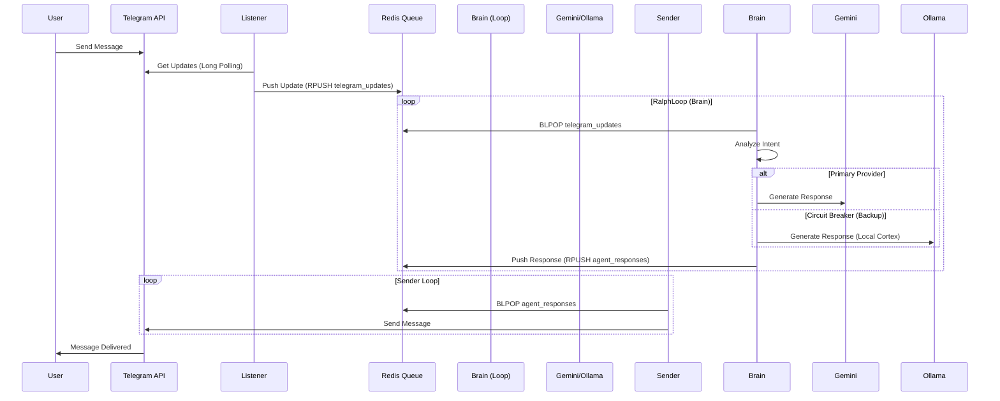

# Архітектура Gemini Observer

**Версія:** 1.0
**Тип:** Event-Driven Async Microservices
**Статус:** Активна (Production-Ready Basics)

---

## 🧠 Загальний Огляд

Gemini Observer — це розподілена система, побудована на принципі **Event Loop**, де компоненти спілкуються виключно через асинхронні повідомлення. Це забезпечує високу стійкість: падіння одного компонента (наприклад, Sender) не блокує роботу інших (наприклад, Listener продовжує збирати повідомлення).

Стрижень системи — **Redis**, який виступає як Message Broker.

---

## 🔄 Схема Потоку Даних (Data Flow)

---

## 🧩 Компоненти Системи

### 1. Listener Service (`gemini-observer/core/listener.py` - *conceptual*)
*Фактично реалізовано як окремий Task в `main.py`*
*   **Функція:** Виконує Long Polling до Telegram API.
*   **Відповідальність:**
    *   Отримання updates.
    *   Дедуплікація (опціонально).
    *   Серіалізація в JSON.
    *   Запис у чергу `telegram_updates`.

### 2. Brain Service (`gemini-observer/core/loop.py`)
*   **Функція:** "Мозок" агента. Обробляє вхідні дані та генерує вихідні.
*   **Клас:** `RalphLoop`.
*   **Логіка:**
    1.  **Input:** Блокуюче читання (`blpop`) з Redis.
    2.  **LLM Routing:** Вибір провайдера через `LLMProvider` (Gemini vs Ollama).
    3.  **System Prompt:** Інструкції для LLM завантажуються з `core/prompts.py` і додаються до контексту.
    4.  **Circuit Breaker:** Якщо Gemini повертає помилку (429, 500, Timeout), автоматично перемикається на `backup_provider` (Ollama).
    5.  **Output:** Запис відповіді у чергу `agent_responses`.

### 3. Sender Service (`gemini-observer/transport/sender.py`)
*   **Функція:** "Руки" агента для відправки повідомлень.
*   **Особливості:**
    *   Використовує `CustomSession` для вирішення проблем з Docker/Windows IPv4.
    *   Управляє Rate Limits Telegram API.

### 4. Memory (FalkorDB)
*   **Функція:** Довгострокова пам'ять.
*   **Зв'язок:** Brain звертається до Memory Provider для збереження/читання контексту перед генерацією відповіді.
*   **Статус:** Базова реалізація графа.
*   **Graph Segregation:**
    *   `agent_memory`: Персональний граф для взаємодії Agent <-> Bot Owner (система).
    *   `group_chat_memory`: Ізольований граф для групових чатів.
    *   Конфігурація через `settings.FALKORDB_GRAPH_*`.

---

## 🛡️ Local Cortex (Механізм Стійкості)

**Local Cortex** — це архітектурний патерн для забезпечення безперервності роботи.

*   **Primary:** Google Gemini (Cloud). Потужна, але має квоти та залежить від мережі.
*   **Backup:** Gemma 2 2B (Local via Ollama). Менш потужна, але повністю автономна і безкоштовна.
*   **Логіка перемикання:**
    *   Brain намагається виконати запит до Main Provider.
    *   `try/except` ловить критичні помилки.
    *   Якщо помилка спіймана -> виклик Backup Provider.
    *   До відповіді додається мета-тег (наприклад, підпис "Generated by Local Cortex"), щоб користувач знав про зниження якості.

### Model Selection (Benchmark Driven)
Вибір локальної моделі (`Gemma 2`, `Mistral`, `Qwen 2.5`) базується на результатах регулярних бенчмарків (`scripts/benchmark_models.py`), які оцінюють:
- **Speed:** Token/sec та Time To First Token (TTFT).
- **Logic:** Здатність генерувати валідний JSON.
- **Resource Usage:** Сумісність з доступним залізом.

---

## 💾 Структура Даних (Redis)

### Черги (Lists)
*   `telegram_updates`: JSON-об'єкти оновлень від Telegram.
*   `agent_responses`: JSON-об'єкти для відправки (`{"chat_id": ..., "text": ...}`).

### Ключі (Keys)
*   `bot_state`: (опціонально) поточний статус бота.

---

## 🚀 Масштабування

Завдяки Redis, кожен компонент можна винести в окремий Docker-контейнер і масштабувати горизонтально (наприклад, запустити 5 Brain-воркерів для обробки черги), якщо навантаження зросте.
